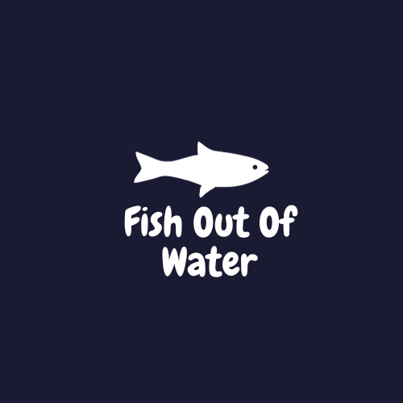
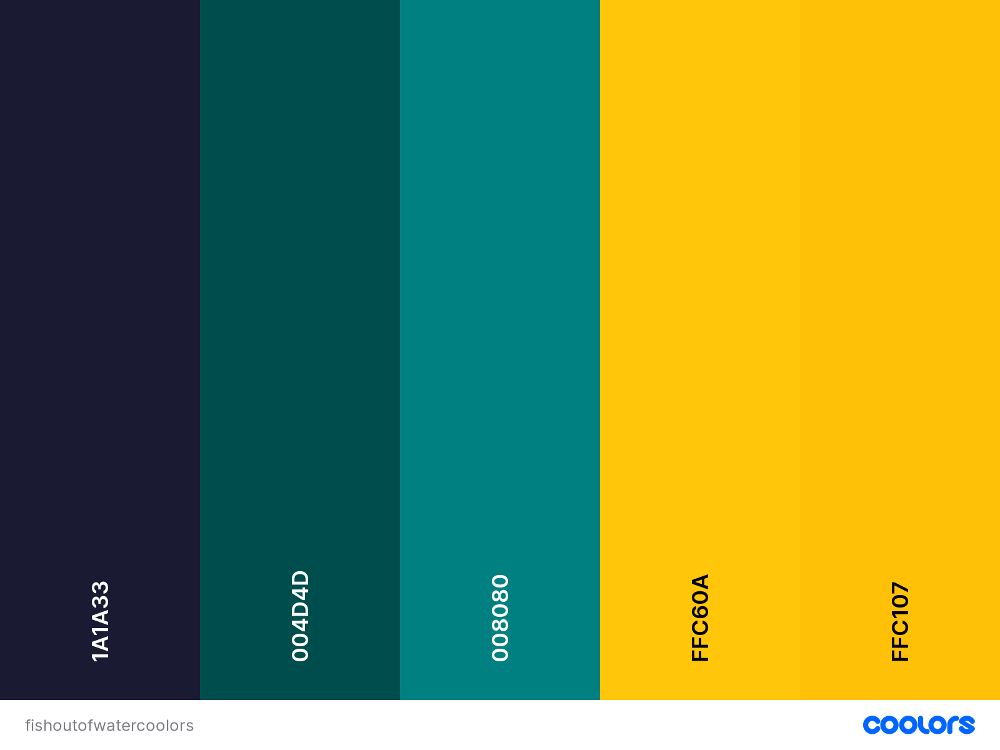
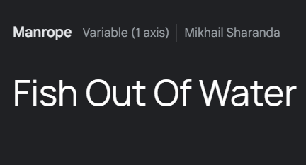

# Fish Out Of Water

Fish out of water is a quiz designed to help scuba diving students prepare for their underwater Fish Identification course.

The requirements to pass a Fish Identification course are to complete an underwater scuba dive with an instructor and correctly identify at least 8 different species of fish, and 5 different types of invertebrates. 

The flash cards show images of marine life for users to study and identify, and learn fun facts about the different animals.

The quiz shows images of fish and other sea creatures that can be found on local dive sites to help them prepare for the underwater exam, and gives users multiple choice questions for them to identify the fish. 

The site can be accessed through this 
[link](https://kimatron.github.io/fish-id/)

## User Stories

### First Time Visitor Goals:

* As a First Time Visitor, I want to easily understand the main purpose of the app, so that I can identify if it is something that will interest me and benefit my needs.
* As a First Time Visitor, I want to be able to easily navigate through the app, so that I don't get frustrated and lose interest.
* As a First Time Visitor, I want to learn more about the fish that I will encounter on my dive, so I can know what to look for and pass my underwater exam.
* As a first time visitor, I want to read some information about marine life that will get me excited about going for a dive.

### Returning Visitor Goals:

* As a Returning Visitor, I want to see re do the quiz and see how many of the creatures I saw on my dive.
* As a Returning Visitor, I want to see updated flash cards with interesting fun facts about marine life.

### Frequent Visitor Goals:
* As a Frequent User, I want to brush up on my skills and learn newly added facts that will make me continue to visit the site.

## Existing Features
### - Home Page
- Positioned at the top of the page.
- Contains the logo of the company on the left side.
- A full responsive navigation bar on the right includes links to the homepage of Deep Breath, a photo Gallery, a short blog on the benefits of scuba diving on mental health, and a Contact Us section. 
- Each section is easy to identify and identical in a manner to allow for easy navigation. 

The purpose of this feature is to allow users to easily identify what features are available on the site and why these features exist and will benefit them to keep exploring.

### Footer
- The footer remains at the bottom of the page and provides easy links to social media pages which are always easily accessible.

### - The landing page image

- The landing page includes an image with text to grab the user's attention and allows them to identify the section that will direct them to information about Underwater Meditation

### - Gallery Page
- A gallery page was added to include images for users to visualize what underwater meditation would look and feel like. It also breaks up any monotonous-looking text blocks.
- Descriptive text describing each image is included for accessibility or in case the image does not load.

### - Benefits
- A benefits page was added to show users the mental and physical health benefits of scuba diving.
- It has a call to action button right after the introduction message that leads to the contact form page.

### Contact page
- The contact page has a contact form that :
    - All text input fields are customized.
   - Important inputs are set to be required to fill out.
    - The submit button is animated on hover.
     - The submit button leads to the response page.
- Contains an interactive map with the location of the dive center.
- Contains a contact us box with a typed physical address.

## Design

### Color Scheme
Dark and light blues and green shades were used to match the underwater and marine life theme so that the images would not clash, and also be more visually appealing to the user. A bright yellow/orange contrast was used to break up the monotony of the blues and to make certain features and information stand out.

### Typography

Main Font 
- Manrope is an open-source modern sans-serif font family, designed by Mikhail Sharanda in 2018 obtained from Google Font. It was used to attract viewers' attention while not being too formal and easy to read.

### Logo
- Logo was designed using a premade fish icon and creating my own style text to sit under it on [Canva](http.canva.com) 

## Deployment

- The site was deployed to GitHub pages. The steps to deploy are as follows: 
  - In the [GitHub repository](https://github.com/kimatron/fish-id), navigate to the Settings tab 
  - From the source section drop-down menu, select the **Main** Branch, then click "Save".
  - The page will be automatically refreshed with a detailed ribbon display to indicate the successful deployment.

The live link can be found [here](https://kimatron.github.io/fish-id/)

## Local Deployment

In order to make a local copy of this project, you can clone it.
In your IDE Terminal, type the following command to clone my repository:

- `git clone https://github.com/kimatron/fish-id.git`

## Potential Future Features

- In the future adding a feature to index local dive shops in a user's area via a mapping tool and linking them to dive shops in their locality would be beneficial.

 - This could also be beneficial to *us* by way of commission of sales possibly.

 - Adding a live booking feature would improve sales and increase response time rather than having to contact us and wait for a response.

## Testing

Please refer to the [TESTING.md](TESTING.md) file for all test-related documentation and bugs.

## Credits
- Used [Code Institute](https://github.com/Code-Institute-Org/ci-full-template) template to start off project.
- Sourced some style code ideas for adjusting photo size and layout from various sources online:
[w3schools](www.w3schools.com),
[Stackoverflow](Stackoverflow.com),
[FreeCodeCamp](www.freecodecamp.org).
- Rewatched Love Math project from [Code Institute](www.codeinstitute.com) for inspiration on how to start setting up my site
- Read through some open source github code to get an idea how to set up the code for modals and flash cards, then worked my code around ideas. For example, I checked the repository from an old javascript project which helped me to understand how everything functioned together more [GitHub Repository](https://github.com/IuliiaKonovalova)  
- Used [Coolors](https://coolors.co/) to get a color scheme to match my images.
- All photos used were my own, taken by me or for me with permission by my co-worker Tony Land.
### Acknowledgments
- Thanks to my fellow coding student Viola Bergere for keeping me motivated and being my second pair of eyes when I was missing a curly bracket or colon when I was fit to smash my computer out the window :)
- And thanks to my mentor Juliia for all her knowledgable guidance and patience with my troubleshooting woes https://github.com/IuliiaKonovalova 
 

---

Happy diving!