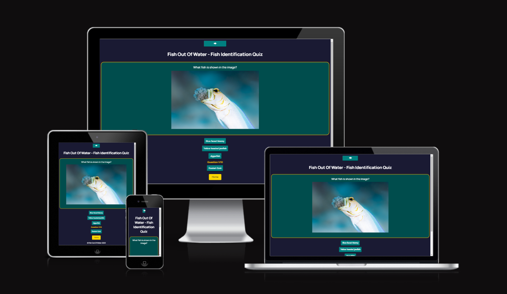

# Fish Out Of Water

Fish out of water is site designed to help scuba diving students prepare for their underwater Fish Identification course.

The requirements to pass a Fish Identification course are to complete an underwater scuba dive with an instructor and correctly identify at least 8 different species of fish, and 5 different types of invertebrates. 

The flash cards show images of marine life for users to study and identify, and learn fun facts about the different animals.

The quiz shows images of fish and other sea creatures that can be found on local dive sites to help them prepare for the underwater exam, and gives users multiple choice questions for them to identify the fish. 

The site can be accessed through this 
[link](https://kimatron.github.io/fish-id/)

## User Stories

### First Time Visitor Goals:

* As a First Time Visitor, I want to easily understand the main purpose of the app, so that I can identify if it is something that will interest me and benefit my needs.
* As a First Time Visitor, I want to be able to easily navigate through the app, so that I don't get frustrated and lose interest.
* As a First Time Visitor, I want to learn more about the fish that I will encounter on my dive, so I can know what to look for and pass my underwater exam.
* As a first time visitor, I want to read some information about marine life that will get me excited about going for a dive.

### Returning Visitor Goals:

* As a Returning Visitor, I want to re do the quiz and see how many of the creatures I saw on my dive.
* As a Returning Visitor, I want to see updated flash cards with interesting fun facts about marine life to keep learning.

### Frequent Visitor Goals:
* As a Frequent User, I want to brush up on my skills and learn newly added facts that will make me continue to visit the site.

## Existing Features
### Home Page
- Logo featured centered in the screen
- Contains a modal with information on the purpose of the site, and information on the developer with contact information to get in touch.
- Responsive index buttons to direct the users to the two main features of the site - Fish Identification Flash Cards and the Fish ID Quiz.
- Each section is easy to identify and identical in a manner to allow for easy navigation. 

The purpose of this feature is to allow users to easily identify what features are available on the site and why these features exist and will benefit them to keep exploring.

### Flash Cards
- Flash card section features many different species of marine life, with vibrant hight quality photos for users to visualize what creatures they may encounter on their dive.
- Flash cards flip around on a user click and display the information of the creature and include a fun fact about each individual animal to keep the studying interesting and informative.
- The flash cards will display randomly and repeat indefinitely.

### - Fish Identification Quiz
- The main feature of the page is the Fish Identification Quiz, which features several images of various marine life (fish and invertebrates)

- Each image has 3 multiple choice options for user to pick from
- There's a reset button to start the quiz again at any point
- A tally draws users attention with a blinking function to let the user know how far along they are in the quiz as they go

- A home button will direct the user back to the index page on every question

  

- There's a result page that only shows when the quiz is complete and tells the user how many questions they got correct out of the amount of questions in the quiz

### Modals
- There are two modals that have images of a fish icon that when clicked will pop up:
- The purpose of the site
 - Information on the developer of the app and how to contact me
    - Rules of the Game
  

## Design

### Color Scheme
Dark and light blues and green shades were used to match the underwater and marine life theme so that the images would not clash, and also be more visually appealing to the user. A bright yellow/orange contrast was used to break up the monotony of the blues and to make certain features and information stand out.

### Typography

Main Font 
- Manrope is an open-source modern sans-serif font family, designed by Mikhail Sharanda in 2018 obtained from Google Font. It was used to attract viewers' attention while not being too formal and easy to read.

### Logo
- Logo was designed using a premade fish icon and creating my own style text to sit under it on [Canva](http.canva.com) 

## Deployment

- The site was deployed to GitHub pages. The steps to deploy are as follows: 
  - In the [GitHub repository](https://github.com/kimatron/fish-id), navigate to the Settings tab 
  - From the source section drop-down menu, select the **Main** Branch, then click "Save".
  - The page will be automatically refreshed with a detailed ribbon display to indicate the successful deployment.

The live link can be found [here](https://kimatron.github.io/fish-id/)

## Local Deployment

In order to make a local copy of this project, you can clone it.
In your IDE Terminal, type the following command to clone my repository:

- `git clone https://github.com/kimatron/fish-id.git`

## Potential Future Features

- In the future adding a feature to have study guides for other dive specialties, such as Search and Recovery Dives, or quizzes featuring different knots and methods and techniques how to tie them.

 - Given more time, I will work on the aesthetic of the index page and the style of the quiz box

 - Adding a section for students to sign up for other courses and specialities on completion of their current certification.

## Testing

Please refer to the [TESTING.md](TESTING.md) file for all test-related documentation and bugs.

## Credits
- Used [Code Institute](https://github.com/Code-Institute-Org/ci-full-template) template to start off project.
- Sourced some style code ideas for adjusting photo size and layout from various sources online:
[w3schools](www.w3schools.com),
[Stackoverflow](Stackoverflow.com),
[FreeCodeCamp](www.freecodecamp.org).
- Rewatched Love Math project from [Code Institute](www.codeinstitute.com) for inspiration on how to start setting up my site
- Read through some open source github code to get an idea how to set up the code for modals and flash cards, then worked my code around those ideas. For example, I checked the repository from an old javascript project which helped me to understand how everything in a quiz functioned together more. Used some of Iuliias code as a base for the flashcards to learn and play around with to add more depth and usefulness to the aim of the page, so editing it to my own as I went along [GitHub Repository](https://github.com/IuliiaKonovalova)  
- Used [Coolors](https://coolors.co/) to get a color scheme to match my images.
- All photos used were my own, taken by me or for me with permission by my co-worker Tony Land in the Cayman Islands. 
- Questions and content written by myself.

### Acknowledgments
- Thanks to Viola for keeping me sane and providing advice at silly o clock in the morning when my eyes weren't working anymore and joining me for a hackathon in the middle of the project, as if we didn't have enough to keep us awake at night :)
- And thanks to my mentor Juliia for not ignoring me and jumping in to answer all my annoying questions whenever she was asked :) https://github.com/IuliiaKonovalova 
 

---

Happy spotting!