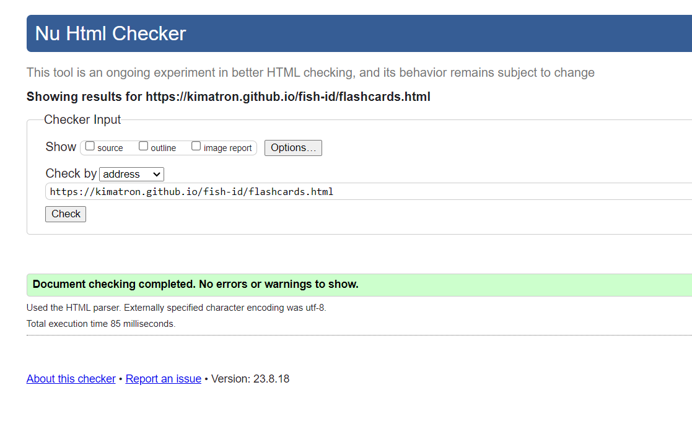
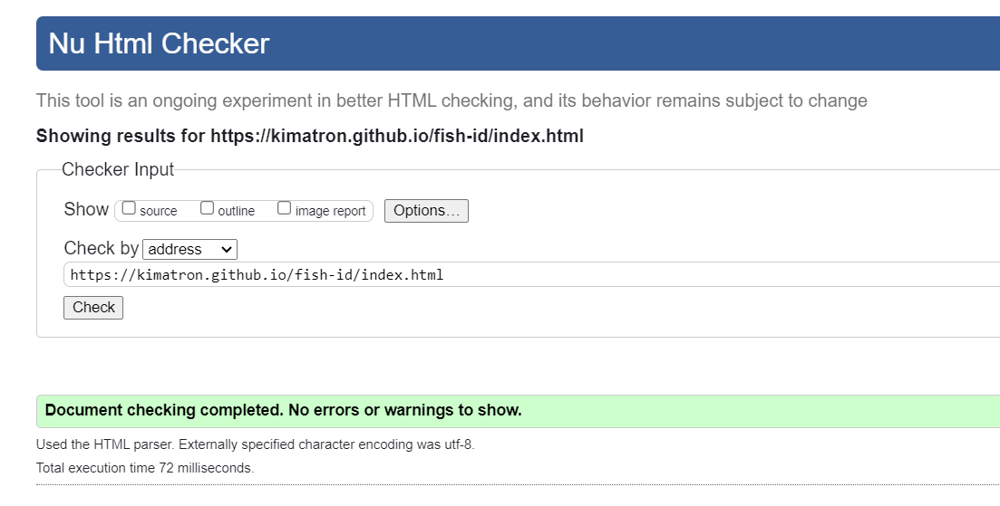
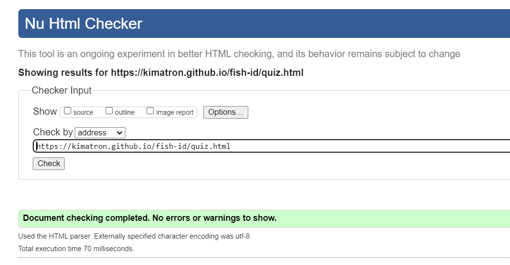
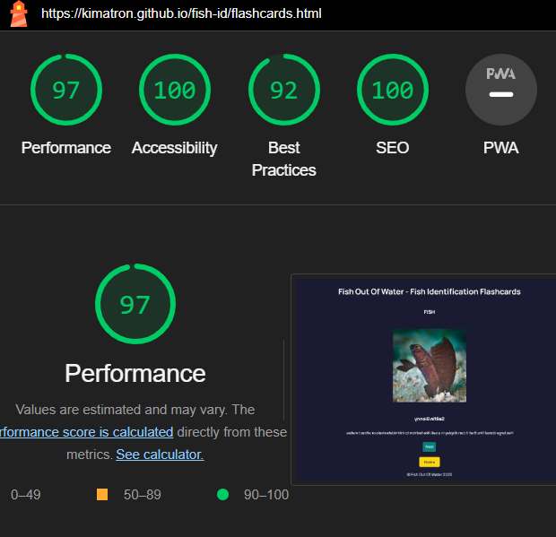
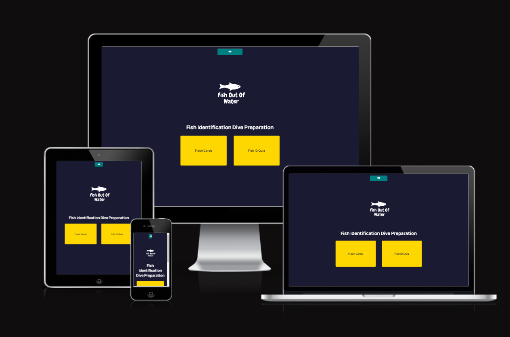

# Testing
 ##### CSS
   - No errors or warnings were found when passing my CSS code through the official [W3C (Jigsaw)](https://jigsaw.w3.org/css-validator/#validate_by_uri) validator 

  

+ ##### Javascript
    - No errors or warnings were found when passing through the official [JSHint](https://jshint.com/) validator once I added the /* jshint esversion: 8 */ code to all my .js files.    

      - FlashCards:

          

      - Fish ID Quiz:

          

      - Index page for Modals:

          
          
  ##### HTML
  All html pages were ran through the W3 validator tests with no issues.
  
  

   

    

          

#### Accessibility and performance 
  - Using lighthouse in devtools I was able to check and confirm that the website is performing well, accessible and colors and fonts chosen are readable. Happy to see all green results after several tests and tweaks on the recommendations of the previous reports

      - Menu Page:

          

      - FlashCards Page:

          

      - Fish ID Quiz:

          
### Responsiveness
- All pages were tested for responsiveness on all sizes of screen. Using Flex for CSS made the coding a lot cleaner and less messy:

### Browser Testing
- All pages were tested multiple times on Chrome, Firefox, MS Edge and on Safari on my iPhone 11.

## Manual testing

| feature | action | expected result | tested | passed | comments |
| --- | --- | --- | --- | --- | --- |
| Index Page Modal | | | | | 
| Open Modal | Click on the fish icon on the modal | The user sees a modal pop up | Yes | Yes | - |
| Links in Modal | Click on the "LinkedIn" link | The user is redirected to my LinkedIn | Yes | Yes | - |
| Links In Modal | Click on the "GitHub" link | The user is redirected to my GitHub page | Yes | Yes | - |
|Close Modal | Click on the "X" in modal | The modal closes and disappears from users screen | Yes | Yes | - |
| Flash Card Button | Click on the Flash Card button | The user is redirected to the Flash Cards | Yes | Yes | - |
| Fish Id Quiz Button | Click on the Fish ID Quiz button | The user is directed to the Fish Id Quiz | Yes | Yes | - |
| Flash Cards | | | | | |
| Flash Cards Click | Click anywhere on the flash card image| The user sees the flip side of the flash card with the information on the image | Yes | Yes | - |
| Next Button | Click on the "Next" button | The user is redirected to the next image | Yes | Yes | - |
| Home Button | Click on the "Home" button | The user is redirected to the index page| Yes | Yes | - |
| Fish Id page | | | | | |
| Multiple Choice Option | Click on an option under the image in question|The user sees the next question appear | Yes | Yes | - |
| Tally Notice | Click on an option under the image in question|The user sees which question they are on as they continue in the game | Yes | Yes | - |
| Refresh Button | Click the refresh button | The users goes back to the start of the quiz | Yes | Yes |  |
| Results Page | User finishes all the questions | The result page with score and feedback appears | Yes | Yes | 

        

# BUGS
- When initially trying to create image quiz, my images would not display, despite writing the code that should have allowed it to do so. I thought it was something to do with my script and function code, and kept trying to edit it there but nothing worked. I finally discovered I had simply placed an image div inside my question container div in the HTML file. Once I removed that the images showed fine. (DEV LIFE - insert peace sign here)
- When adding an image to the resultContainer to display when the results were shown, the image keeps appearing under the questions as well. Also, when I refresh the quiz, the results and the image aren't showing on the repeat of the quiz.
  - This was fixed after several days of googling anda  day off with some fresh eyes. I had made a simple mistake with the DOM.
- One of the images of the arrowcrab on the quiz is too big on larger screens, but for some reason when I try to change the code it causes more problems.
  - Removing the max and min width on the css file and changing to 100% and 400px sorted this error.
- When I tried to change the style of the flashcards to have different colour and shadow, the text on the flip disappears. I undid the style changes to temporarily fix the problem, but once I get time I will make the design of the flashcards more visually appealing.
- While trying to style the footer, a simple code in css centered and made a neat footer at the end of the index page, but it somehow removed the HOME button on the flashcards and quiz pages. 
